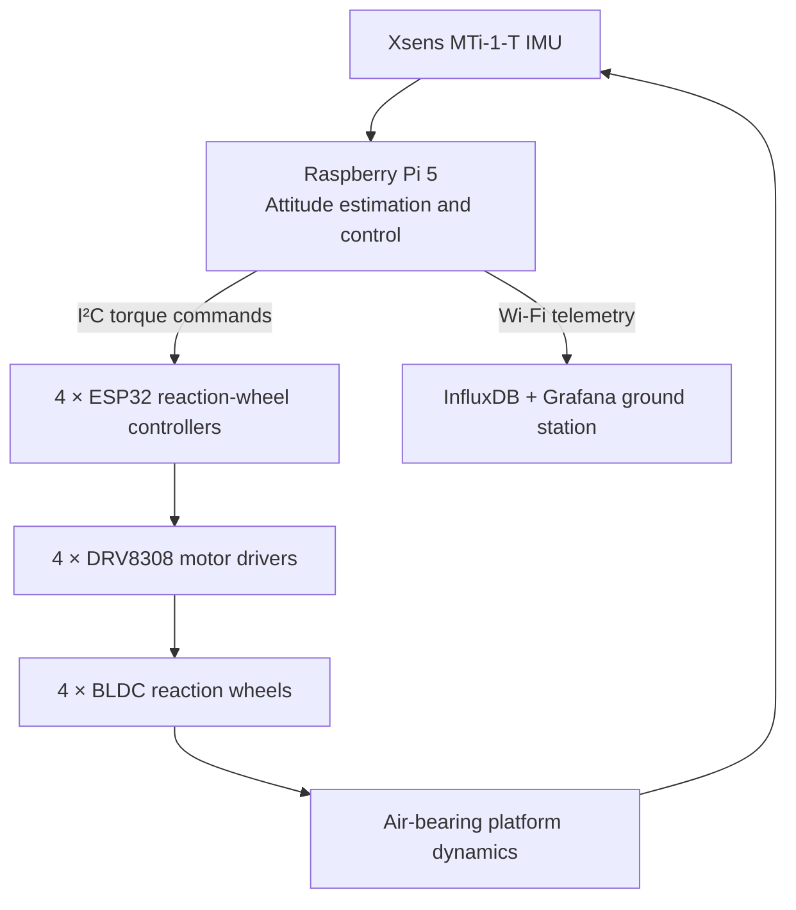

# Spacecraft Attitude Control System (SACS) Testbed

SACS is a three-axis spacecraft attitude determination and control system (ADCS) testbed developed to evaluate attitude-control algorithms on hardware. The platform uses a spherical air bearing to approximate torque-free rotational motion, four reaction wheels for actuation, an IMU for attitude feedback, and movable counterweights for balancing.

The project is the successor to the original SADS platform and is being developed as part of a master's thesis at California Polytechnic State University, San Luis Obispo.

> **Project status:** Active research and development. Interfaces, controller gains, and hardware configuration may change as testing continues.

## System overview

The testbed consists of four main subsystems:

- **Mechanical platform:** Three-axis spherical air bearing with six stepper-driven counterweights for center-of-mass balancing.
- **Reaction-wheel assembly:** Four reaction wheels arranged in a pyramid configuration for redundant three-axis control.
- **Flight computer and sensors:** A Raspberry Pi 5 runs the high-level control system and reads attitude data from an Xsens MTi-1-T IMU.
- **Ground station:** Telemetry is transmitted over Wi-Fi and displayed using InfluxDB and Grafana.



## Hardware

| Component | Description |
| --- | --- |
| Onboard computer | Raspberry Pi 5 |
| IMU | Xsens MTi-1-T |
| Reaction wheels | 4 × Nanotec DF32M024027-A BLDC flat motors |
| Motor drivers | 4 × Texas Instruments DRV8308 |
| Wheel controllers | 4 × DFRobot FireBeetle ESP32 |
| Wheel arrangement | Four-wheel pyramid, approximately 28° from vertical |
| Balancing system | 6 stepper-driven movable counterweights |
| Test environment | Three-axis spherical air bearing |
| Motor power | 24 V |

## Software architecture

The Raspberry Pi performs attitude estimation, computes the requested body torque, allocates that torque among the four reaction wheels, and sends individual wheel commands to the ESP32 controllers over I²C.

Each ESP32:

1. Receives a commanded wheel torque.
2. Integrates the torque command into a wheel-speed setpoint.
3. Commands the DRV8308 motor driver using closed-loop CLKIN control or open-loop PWM when required.
4. Measures wheel speed using the driver's `FGOUT` signal.
5. Reports wheel speed and diagnostic state to the Raspberry Pi.

The nominal high-level control loop runs at **20 Hz**. Controllers under evaluation include:

- Euler-angle PD control
- Quaternion-error PD control
- Body-rate damping control
- Single-axis slew and stabilization control

A typical quaternion feedback law is

$$
\boldsymbol{\tau}_c =
-K_p\,\operatorname{sgn}(\eta_e)\,\boldsymbol{\epsilon}_e
-K_d\,\boldsymbol{\omega},
$$

where $\eta_e$ and $\boldsymbol{\epsilon}_e$ are the scalar and vector components of the attitude-error quaternion, and $\boldsymbol{\omega}$ is the measured body angular velocity.

## Coordinate system and wheel numbering

When viewed from above:

- $+x$ points right.
- $+y$ points up.
- $+z$ points out of the page.
- The wheels are numbered clockwise: **RW0** top-left, **RW1** top-right, **RW2** bottom-right, and **RW3** bottom-left.

Keep the coordinate convention synchronized across the IMU configuration, control law, wheel-allocation matrix, telemetry, and analysis scripts. A sign mismatch in any one of these locations can produce positive feedback instead of stabilization.

## Telemetry

The ground station records and displays values including:

- Estimated attitude and body angular velocity
- Desired and measured reaction-wheel speeds
- Requested body torque and allocated wheel torques
- Last wheel-speed and torque commands
- DRV8308 `LOCKn` and `FAULTn` states
- Controller mode and loop timing

## Repository organization

The repository is intended to separate flight software, wheel-controller firmware, ground-station configuration, analysis tools, and documentation:

```text
SACS/
├── flight_software/       # Raspberry Pi control and communications software
├── wheel_controller/      # ESP32/FreeRTOS reaction-wheel firmware
├── ground_station/        # Grafana, InfluxDB, and Telegraf configuration
├── analysis/              # MATLAB/Python test-data analysis
├── hardware/              # Schematics, PCB files, CAD exports, and wiring
├── docs/                  # System documentation and test procedures
└── README.md
```

Adjust this section to match the final directory structure as the repository is populated.

## Getting started

The setup procedure is still being formalized. Before operating the complete platform:

1. Verify the 24 V motor supply and Raspberry Pi supply independently.
2. Confirm common ground and inspect the I²C trunk, short branch connections, and pull-up configuration.
3. Power and test each reaction-wheel controller individually.
4. Verify wheel numbering, motor direction, `FGOUT`, `LOCKn`, and `FAULTn` behavior.
5. Confirm IMU axes and signs using small manual rotations.
6. Test the torque-allocation signs with the air supply **off**.
7. Balance the platform and begin air-bearing tests with conservative torque and angle limits.

Project-specific build, flash, and launch commands should be added here once the repository layout and build system are finalized.

## Safety

This platform contains exposed rotating hardware and operates from a 24 V supply. Reaction wheels can store substantial kinetic energy.

- Wear eye protection during powered testing.
- Keep hands, cables, and loose objects clear of rotating assemblies.
- Secure the platform whenever the air bearing is not under active test.
- Use conservative speed, torque, and attitude limits during initial validation.
- Provide a readily accessible method to disable motor power.
- Do not operate a wheel that shows mechanical damage, abnormal vibration, or unexpected driver faults.

## Current development priorities

- Validate consistent reaction-wheel response and speed-tracking delay.
- Verify the wheel-allocation matrix and sign conventions on all three axes.
- Improve startup IMU calibration and bias handling.
- Characterize system inertia and actuator response experimentally.
- Complete three-axis stabilization and slew testing.
- Expand automated telemetry analysis and test reporting.

## Contributing

This is currently an academic research project. If the repository is opened to outside contributions, add contribution guidelines and use GitHub issues to document bugs, test results, and proposed changes.

## License

No license has been selected yet. Until a license is added, all rights are reserved by default. Confirm that the repository contains no export-controlled, proprietary, security-sensitive, or employer-owned material before making it public.

## Author

**Bricen Rigby**  
California Polytechnic State University, San Luis Obispo

