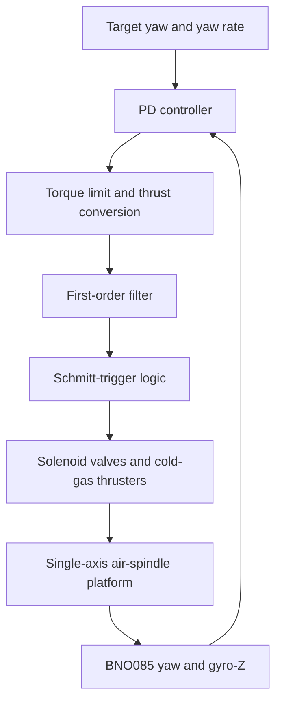

# SACS — Spacecraft Attitude Control Simulator

SACS is a single-axis, nearly frictionless spacecraft attitude-control testbed developed during Cal Poly's 2024 Summer Undergraduate Research Program (SURP). The platform rotates about its vertical $z$-axis on an air spindle and uses paired cold-gas thrusters to perform yaw maneuvers.

This repository contains the embedded control software and MATLAB/Simulink models used to simulate, command, and validate the platform.

> SACS is the original **single-axis SURP platform**. It is distinct from SADS, the three-axis spherical-air-bearing platform.

## Project goals

SACS was developed to:

- Create a low-complexity, low-friction physical analog of single-axis spacecraft rotation.
- Implement closed-loop yaw control using cold-gas thrusters.
- Compare predicted MATLAB/Simulink behavior with experimental results.
- Provide a testbed for control-law tuning and pulse-modulated actuator logic.

## System overview

The platform is built on an aluminum-extrusion frame supported by a porous-carbon air spindle. A compressed-gas supply feeds solenoid valves connected to opposing nozzle pairs. The nozzles are mounted at a moment arm from the center of rotation so that each pair produces positive or negative torque about the $z$-axis.

A BNO085 IMU measures platform yaw and angular rate. The embedded controller compares these measurements with the target state, calculates a desired torque using a PD control law, and converts the continuous command into discrete thruster firings.



## Control system

### PD attitude controller

The controller uses yaw-angle error and yaw-rate error:

$$
u = K_p(\theta_d-\theta) + K_d(\dot{\theta}_d-\dot{\theta}),
$$

where $u$ is the requested control torque. The gains can be selected from the desired natural frequency $\omega_n$, damping ratio $\zeta$, and estimated platform inertia $I_{zz}$:

$$
K_p = I_{zz}\omega_n^2,
\qquad
K_d = 2\zeta\omega_n I_{zz}.
$$

The requested torque is limited to the torque available from the thrusters and converted into the equivalent force required from each nozzle.

### Thruster modulation

Because the solenoid valves are on/off actuators, they cannot directly produce the continuous thrust requested by the PD controller. The embedded software therefore applies:

1. A first-order filter to the magnitude of the desired thrust.
2. A Schmitt trigger with separate on and off thresholds to provide hysteresis.
3. Sign logic to select the positive- or negative-torque thruster pair.

This PWPF-style approach reduces rapid valve switching while approximating a continuous control command with discrete pulses. This reduces fuel use while maintaining pointing within predefined thresholds.

### Operator controls

An IR remote is used to:

- Enable or disable closed-loop thruster firing [Power Button].
- Increment or decrement $K_p$ and $K_d$ [Volume +/-].
- Adjust the target yaw angle [see code].
- Adjust the target yaw rate [see code].

## Hardware represented by the software

| Component | Function |
| --- | --- |
| Single-axis air spindle | Provides nearly frictionless rotation about the vertical axis |
| Aluminum-extrusion platform | Supports the avionics, gas system, and thruster moment arms |
| Compressed-gas supply | Supplies the cold-gas propulsion system |
| Opposing nozzle pairs | Apply positive or negative yaw torque |
| Solenoid valves | Switch the thrusters on and off |
| BNO085 IMU | Measures yaw angle and angular velocity about $z$ |
| Embedded controller | Runs the feedback and thruster-modulation logic |
| IR receiver and remote | Enables the system and supports live tuning |

## Repository contents

| File | Description |
| --- | --- |
| `SACS_CS_1.3.ino` | Embedded PD controller, BNO085 interface, IR-remote input, filtering, and Schmitt-trigger thruster logic |
| `ControlledMotion.slx` | Simulink model of the closed-loop platform dynamics and pulsed-thruster controller |
| `ControlledMotionScript.m` | Defines controlled-motion parameters, runs the model, and plots attitude, body rate, and torque |
| `TorqueFreeMotion.slx` | Simulink model of rotational motion used to evaluate the platform dynamics |
| `TorqueFreeMotionScript.m` | Defines the inertia, applied torque, and initial conditions for the torque-free-motion model |

## Software requirements

### Embedded controller

- Arduino IDE or a compatible build environment
- [SparkFun BNO080/BNO085 Arduino Library](https://github.com/sparkfun/SparkFun_BNO080_Arduino_Library)
- [Arduino-IRremote](https://github.com/Arduino-IRremote/Arduino-IRremote)

The current sketch expects:

- BNO085 I²C address: `0x4A`
- I²C clock: `400 kHz`
- IMU update period: `50 ms`
- Positive- and negative-torque solenoid outputs: pins `3` and `4`
- IR receiver input: pin `15`
- Serial baud rate: `115200`

Confirm the target board, pin mapping, valve-driver polarity, and electrical interface before uploading the sketch.

### Simulation

- MATLAB
- Simulink
- Stateflow

The models were saved using MATLAB/Simulink R2024a. Compatibility with earlier releases is not guaranteed.

## Running the simulations

Place each script in the same directory as its corresponding Simulink model.

### Controlled motion

Open MATLAB in the repository directory and run:

```matlab
ControlledMotionScript
```

The script sets the inertia, initial attitude and body rate, controller gains, Schmitt-trigger thresholds, thruster torque, and simulation duration. It then runs `ControlledMotion.slx` and plots:

- Yaw angle versus time
- Angular velocity versus time
- Desired and commanded torque versus time

### Rotational dynamics

Run:

```matlab
TorqueFreeMotionScript
```

This initializes the inertia matrix, applied torque, initial angular velocity, and simulation duration before running `TorqueFreeMotion.slx`.

## Running the physical platform via cold gas thrusters.

1. Place the platform onto a flat and level surface.
2. Place the paintball canister into the sleeve in the center of the platform and attach it's output hose to the thruster manifold. Be sure not to open the valve on the paintball canister until immediately prior to running a control test.
3. Ensure that the air compressor is powered and connected to the inlet of the Air Spindle, and flip the lever to turn on the air compressor. This will allow the platform to freely spin. The air compressor will fill to ~120psi and then shut off until it falls to ~90psi, and then refill until powered off.
4. Verify that the platform is balanced and free to rotate without cable interference. In the somewhat likely event of an unbalanced platform, you can shim the four corners with thin microfiber towels and check  the proper orientation of the platform with a levels.
5. Open the valve of the paintball canister to allow pressurized air into the thruster manifold.
6. Press the IR-remote power button to enable once the paintball canister's valve has been opened and the platform is freely spinning. The power button can be used to enable/disable control at any time for convenience of testing/demonstration.
7. Once the test is complete, disable control via the power button on the IR-remote to stop the valves from opening.
8. Once the platform is settled to a stop, close the valve on the paintball canister, and then re-enable thruster control one last time in order to purge the lines of any remaining pressurized air.
9. Once the lines have been purged, the paintball canister can be removed and the platform can be stowed.


## Experimental validation

The Simulink model was used to predict the controlled yaw response and compare it with the physical platform. Repeated large-angle maneuver tests settled in roughly **14–15 seconds**, closely matching the simulated response. Differences between the model and experiment were attributed primarily to uncertainty in delivered thrust and unmodeled friction.

## Safety

This project operates pressurized gas, electrically actuated valves, and a freely rotating structure.

- Wear eye protection during pressurized testing.
- Keep people and loose objects outside the platform's swept area.
- Never provide power to the valves while hands or tools are near a nozzle or moving structure.
- Always keep the paintball canister's valve closed until undergoing pressurized testing to avoid unexpected mishaps with the valves.
- Depressurize the system before changing pneumatic connections.
- Provide accessible electrical and pneumatic emergency shutoffs.

## Academic context

SACS was originally developed by **Bricen Rigby** through the 2024 Summer Undergraduate Research Program in the Aerospace Engineering Department at California Polytechnic State University, San Luis Obispo, under the guidance of **Professor Eric Mehiel**. It has since been used in multiple theses related to spacecraft attitude control simulation and testing for its utility in sensor, actuator, and control system validation.

## License

No license has been selected. Until a license is added, the source is not automatically licensed for reuse, modification, or redistribution.

